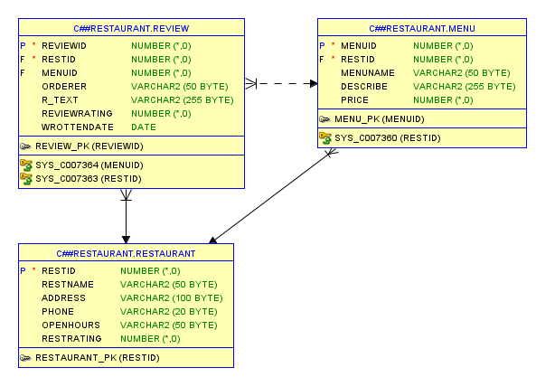

### Chungbuk_Univ_DB
<h2>데이터베이스란 무엇인가 ?</h2>
* 데이터들의 모임
* 저장매체에 저장되어 있는 데이터
* 조직의 운영을 위해 사용되는 데이터

<h2>데이터베이스의 특징</h2>
* 실시간 접근성
* 계속적인 변화
* 동시 공유
* 내용에 따른 참조  

|도서번호|도서이름|출판사|가격|
|:---:|:---:|:---:|:---:|
|1|축구의 역사|굿스포츠|7000|
|2|축구 아는 여자|나무수|13000|
|3|축구의 이해|대한미디어|22000|
|4|골프 바이블|대한미디어|35000|
|5|피겨 교본|굿스포츠|8000|  

---

<u>릴레이션 구조와 관련된 용어</u>
|**릴레이션 용어**|**같은 의미로 통용되는 용어**|**파일 시스템 용어**|
|:---|:---|:---|
|릴레이션(relation)|테이블(table)|파일(file)|
|스키마(schema)|내포(intenstion)|헤더(header)|
|인스턴스(instance)|외연(extension)|데이터(data)|
|튜플(tuple)|행(row)|레코드(record)|
|속성(attribute)|열(column)|필드(field)|

